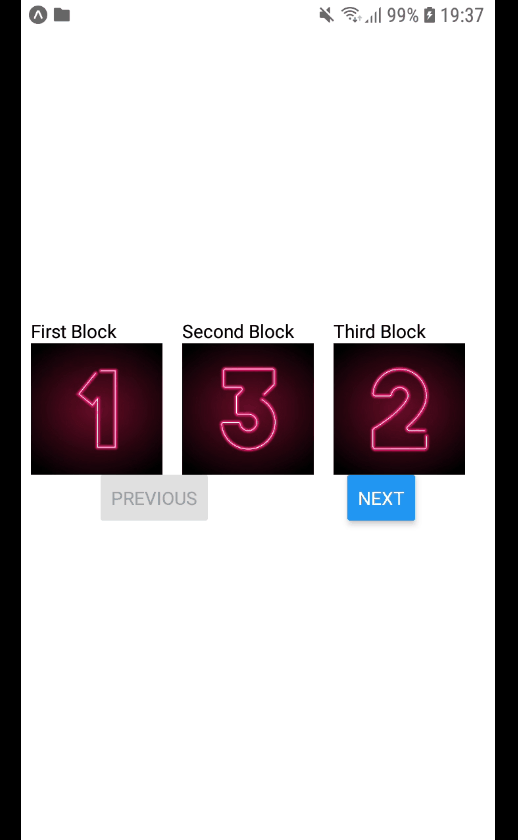
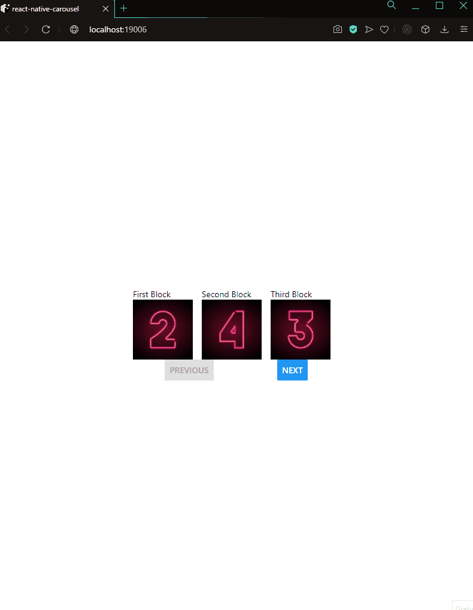

# How to start the app

The first thing you have to do, is clone the repository into your computer. Then, after you opened it with your code editor, 
write in your terminal/console the command: $ npm start
After that, the app will automatically open up in your browser!

Next step: If you want to use the app in your mobile, you have to scan the QR code with the "Expo" application. After a few seconds, the app should be up and running!
If you want to use it in your browser, choose the option "Run in web browser" on the tab that opened with the "npm start" command.

# Mobile browser view:

# Web browser view:

